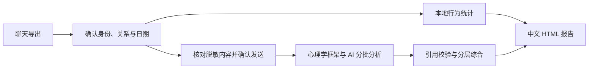

# ChatArchiveTool

**聊天归档 · 四类关系观察 · 中文论文式报告**

把 QQ／微信聊天记录整理成可离线回看的档案，再从朋友、亲人、恋人或闺蜜／亲密朋友的视角，观察互动方式与双方的表达形象。

`Windows x64 / macOS` · `桌面包免装 Python` · `本地基础分析` · `可选 AI API`

[快速开始](#快速开始) · [报告内容](#报告包含什么) · [心理学框架](#四类关系与心理学框架) · [开发文档](#开发与验证)

## 这个工具能做什么

| 能力 | 当前实现 |
| --- | --- |
| 聊天归档 | 导出或整合 QQ／微信聊天，关联图片、表情、音频和已有语音转写 |
| 导出文件读取 | 支持 QCE JSON／JSONL、微信原生 ZIP／TXT、wechat-chat-export JSON 和统一档案 |
| 关系观察 | 确认双方身份，再选择朋友、亲人、恋人或闺蜜／亲密朋友视角 |
| 本地分析 | 统计联系节奏、会话发起、回应间隔与表达行为，无需 API |
| AI 分析 | 使用所选关系的心理学框架，完整分批处理文字并综合结果 |
| 报告输出 | 中文双栏 HTML、3D 日期热力图、统计图表、双方交流形象与沟通建议 |

关系分析目前支持**身份可辨认的双人会话**。四类关系由用户选择，作为观察视角使用。

## 从聊天到报告



| | 本地基础分析 | AI 分析 |
| --- | --- | --- |
| 是否需要密钥 | 无需 | 远程服务需要；本机服务可留空 |
| 处理内容 | 有效消息的行为统计、文字规则匹配 | 所选日期内全部有效文字与已有语音转写 |
| 结果侧重 | 互动节奏、表达习惯与回顾提示 | 基于语境的互动解释、表达特点与沟通建议 |
| 处理位置 | 本机，不上传聊天 | 用户核对并确认后发送至所选服务 |

本地模式提供描述性统计与规则提示。AI 模式把具体行为、心理学解释与其他可能原因分开呈现；双方画像只描述这段记录中的表达与回应。

## 快速开始

### 下载桌面版（推荐）

打开 [Releases 下载页面](https://github.com/schnitzlermandy85-beep/ChatArchiveTool/releases)，在同一版本的 **Assets** 中按电脑选择：

| 电脑 | 下载文件 | 启动方式 |
| --- | --- | --- |
| Windows 64 位 | `ChatArchiveTool-v版本-Windows-x64.zip` | 完整解压，打开 `ChatArchiveTool/ChatArchiveTool.exe` |
| Mac，Apple 芯片（M 系列） | `ChatArchiveTool-v版本-macOS-AppleSilicon.zip` | 解压，把 `ChatArchiveTool.app` 拖到“应用程序”后双击 |
| Mac，Intel 芯片 | `ChatArchiveTool-v版本-macOS-Intel.zip` | 解压，把 `ChatArchiveTool.app` 拖到“应用程序”后双击 |

Mac 可在苹果菜单 →“关于本机”查看芯片类型。下载带系统名称的 ZIP；GitHub 自动生成的 **Source code** 是源码，需要自己安装 Python。发布流程在版本标签推送后构建这些下载文件。

桌面包包含 Python 运行环境，使用浏览器显示界面。首次启动后选择“关系分析”，载入下载包中的 `examples/synthetic-chat`，确认身份并生成本地报告。示例不含真实个人数据；也可以打开 `examples/sample-report.html` 查看报告效果。退出时点击界面的电源按钮，关闭浏览器标签不会停止后台服务。

<a id="mac-open-anyway"></a>

### Mac 提示“Apple 无法验证”怎么办？

首次打开时，可能看到：

> Apple 无法验证“ChatArchiveTool”是否包含可能危害 Mac 安全或泄漏隐私的恶意软件。

当前 Mac 版本只有本地 ad-hoc 签名，尚未使用 Apple Developer ID 正式签名，也未完成 Apple 公证，因此 macOS 会拦截首次打开。这个提示本身不能判断应用是否包含恶意软件。

确认安装包来自 [本仓库的 Releases](https://github.com/schnitzlermandy85-beep/ChatArchiveTool/releases)，且未被修改后，可按以下步骤打开：

1. 解压 ZIP，将 `ChatArchiveTool.app` 拖到“应用程序”文件夹，再双击一次。
2. 出现上述提示时，点击“完成”或关闭弹窗。
3. 打开 **苹果菜单 → 系统设置 → 隐私与安全性**，向下滚动到“安全性”区域。
4. 找到 ChatArchiveTool 被阻止打开的提示，点击 **“仍要打开”**。
5. 按系统提示使用 Touch ID 或输入 Mac 登录密码，再点击 **“打开”**。

此操作会为这个应用添加打开例外，之后通常可以直接双击启动。如果找不到“仍要打开”，先再次尝试打开应用，再回到“隐私与安全性”查看；由单位或学校管理的 Mac 可能需要联系管理员。

操作依据：[Apple 官方说明：在 Mac 上安全地打开 App](https://support.apple.com/zh-cn/102445)。

### 源码启动

建议安装 **Python 3.12**。Windows 文件选择器需要 Tkinter；Mac 使用系统原生文件选择器。

```bash
git clone https://github.com/schnitzlermandy85-beep/ChatArchiveTool.git
cd ChatArchiveTool
```

- Windows：双击 `start.cmd`，或运行 `py -3.12 app.py --check` 检查环境。
- Mac：双击 `start.command`，或在终端运行 `bash start.command`；运行 `python3 app.py --check` 检查环境。

源码启动优先使用项目中的 `.venv`。使用期间保持终端窗口运行。

<details>
<summary>启动后没有浏览器窗口</summary>

打开数据目录中的 `打开界面.html`，或复制 `logs/current-url.txt` 中的本机网址到浏览器。启动日志为同一目录下的 `logs/startup.log`。

- Mac 桌面版：`~/Library/Application Support/ChatArchiveTool/`。
- Windows 桌面版：`%LOCALAPPDATA%\ChatArchiveTool\`。
- 源码版：项目目录。

归档默认保存到该目录的 `exports/`，也可在界面中选择其他位置。

也可以仅启动本机服务，再手工访问网址：

```powershell
py -3.12 app.py --no-browser
```

启动程序已加入浏览器快速失败后的回退，并将浏览器打开与本地服务分开运行。`start.cmd` 优先使用项目 `.venv`，其次使用 `py -3.12`，最后尝试 PATH 中的 Python。

</details>

## 用自己的聊天记录分析

支持载入：

- QQChatExporter 的 JSON、JSONL 或 ZIP。
- 包含 `manifest.json` 和完整消息分块的会话文件夹；选择会话主目录。
- 本工具导出的统一档案文件夹或 `messages.jsonl`。

读取后，确认身份，选择关系和日期。本地模式可直接生成报告；切换 AI 模式后，分别填写**服务地址、模型 ID、API Key**，检查发送预览，再开始分析。

AI 接口支持能按要求返回 JSON 文本的 **Chat Completions 兼容服务**，不限 DeepSeek。接受服务根地址、`/v1` 地址或完整 `/chat/completions` 地址；远程使用 HTTPS，本机允许 HTTP。具体兼容程度取决于服务商和模型。

全部有效文字按时间完整分批，已有转写一并处理；图片和未转写音频只参与本地统计。长记录会产生多次 API 调用及相应费用。全部批次与综合通过后才标记全量完成；超限会提示，失败会注明完成情况并回退本地统计。

“补充分析要求”最多 2000 字符，用于调整关注重点；主辅理论、引用要求和输出规则已内置。修改要求后需要重新核对预览。

## 四类关系与心理学框架

| 关系视角 | 主理论 | 辅助理论／研究 | 优先观察 |
| --- | --- | --- | --- |
| 亲人 | 家庭系统理论 | 角色理论、依恋理论 | 职责与期待、互动边界、支持与回应 |
| 恋人 | 依恋理论 | 爱情三角理论、相互依赖理论、Gottman 伴侣互动研究 | 亲近回应、共同约定、承诺表达与冲突修复 |
| 朋友 | 社会交换理论 | 社会渗透理论、互惠规范、关怀性与交换性关系区别 | 长期互助、共同活动与协调 |
| 闺蜜／亲密朋友 | 社会渗透理论 | 自我表露、社会支持、共同反刍研究 | 个人分享、接纳回应、情绪支持与隐私边界 |

四种视角共用八个观察维度：**亲近寻求与回应、角色义务与期待、自我表露与接纳、互惠协调、关系边界与约定、情绪支持、共同活动、未来计划与承诺**。不同关系改变优先顺序，证据不足时允许少作解释。

主辅配置是产品的观察顺序。理论用于组织互动解释，不诊断依恋类型、人格或疾病，不生成爱意、信任、匹配或关系质量分数，也不预测关系走向。引用校验和多片段标签是工程规则，不能证明心理解释正确。

详见 [完整内置分析要求与来源](docs/psychology-requirements.txt)。

## 报告包含什么

报告采用中文双栏正文，包含摘要、数据与方法、互动统计、关系观察、双方交流形象和沟通建议。

| 图表 | 回答的问题 |
| --- | --- |
| 3D 日期热力图 | 哪些日期有聊天，联系如何分布？ |
| 日内时段图 | 聊天通常发生在一天中的什么时候？ |
| 消息媒介构成图 | 文字、语音及其他媒介如何使用？ |
| 双方行为对照表 | 谁开启会话，记录中的回应间隔如何分布？ |

输出位于输入档案目录的 `relationship-reports/时间-随机标识/`：

- `report.html`：可离线打开，浏览器打印时可保存为 PDF。
- `report-data.json`：结构化统计与分析结果。

分享文件不内嵌完整聊天和发送预览；模型解释仍可能复述部分聊天内容，分享前请核对。

## 可选导出与语音组件

QQ 直读通过按需安装的 QQChatExporter 提供。Windows 微信使用 wechat-chat-export；Mac 微信使用下方需要明确授权的独立读取流程。组件下载固定版本并核对 SHA-256，保存在当前用户的数据目录，不写入应用包。

| 功能 | Windows x64 | Apple 芯片 Mac | Intel Mac |
| --- | --- | --- | --- |
| 导入已有导出、归档、关系分析、HTML 报告 | 支持 | 支持 | 支持 |
| QQ 直接导出 | 安装并登录 QCE | 安装并登录 QCE（上游预览版） | 自行部署本机 QCE，或导入 |
| 微信直接读取 | 原 Windows 可选组件 | 微信 4.x：授权签名准备后直连，需自行验收 | 微信 4.x：同样需要签名准备，需自行验收 |
| 新语音转写 | 源码版可选依赖 | 源码版可选依赖 | 源码版可选依赖 |

### Mac 连接 QQ

1. 在 QQ 来源面板点击 **安装 QQ 组件**，下载 [QQChatExporter v6.3.2](https://github.com/shuakami/qq-chat-exporter/releases/tag/v6.3.2)。
2. 完全退出桌面 QQ，再点击 **启动 QQ 导出服务**。终端按上游流程创建独立 QQ 副本并重新签名，与原客户端共享本机数据。按提示扫码登录，保持终端运行，期间不要同时打开桌面 QQ。
3. 返回本工具点击 **连接 QQ**，选择好友或群聊并导出。连接时会重新读取本机服务令牌，首次启动后不用重开本工具。详细要求见 [QCE 官方 Mac 指南](https://shuakami.github.io/qq-chat-exporter/docs/macos-deploy.html)。

### Mac 微信：直接读取文字、图片、视频（v0.1.5）

实现参考 [qwe11223/wechat-exporter-mac](https://github.com/qwe11223/wechat-exporter-mac)，固定提交 `231884e745d03206629dafbc6e13339269dc96c3`（MIT）。桌面包内置读取和媒体解码依赖，支持 Mac 微信 4.x。无需安装 Python、配置 API 或输入终端命令。

1. 下载对应芯片的 Mac 桌面包，将 App 拖入“应用程序”。选 **微信 → 直接导出**。
2. 阅读并勾选签名修改说明。先手动退出微信（菜单“退出微信”或 ⌘Q），再点 **1. 准备读取**。
3. 工具备份原微信程序，然后通过 macOS 系统弹窗授权修改微信签名。此步骤移除微信程序的强化运行时保护，可能影响截图、录屏权限，需要重新授权；不会修改聊天数据库，不会关闭 SIP。
4. 点 **2. 打开微信并登录**，自行完成登录。打开目标聊天，查看需保存的图片和视频，等待下载。
5. 点 **3. 连接并检查**，在系统弹窗授权读取。使用只读内存扫描，不附加调试器、不暂停或强退微信。密钥只保存在当前用户私有数据目录，不进入日志或档案。
6. 填写准确好友备注、群名或 wxid，选择日期和保存位置，开始导出。先用“文件传输助手”的几条非敏感文字、图片、视频测试，再检查生成档案。

**范围：** 只导出本机已有消息。逐个验证所有消息分片，包含尚未合并的 WAL 更新；任一消息分片读取失败会停止，避免悄悄漏消息。图片按会话和消息标识定位，不按文件日期/排序猜测；支持 DAT 解码和部分 HEVC 图片转换。视频保存本机 MP4。语音尽量保存 WAV，解码失败保留 SILK；贴图和其他附件原文件提取仍不完整。缺失或无法唯一关联的媒体保留占位，缩略图明确提示。未下载、过期、只在手机上的媒体不能凭空恢复。

**授权或连接失败：** 确认准备前已退出、准备后已重新登录。文件访问被拒绝时，在“系统设置 → 隐私与安全性 → 完全磁盘访问”允许 ChatArchiveTool，再完全退出重开工具。多账号时在来源设置选择当前账号的 `db_storage` 文件夹。微信升级后可能需要重新准备与连接；若仍被系统拒绝，请停止反复授权。不能保证适配每一个微信版本。

**恢复：** 先退出微信，点击 **恢复微信程序**。只恢复本工具备份的同版本程序；聊天数据不变。微信已升级或无备份时，从微信官网下载当前版本覆盖安装，勿删除聊天数据目录。

**已有文件：** 可继续导入 `chat_full_parsed.json` 及其媒体文件夹；原生 ZIP / TXT / Dukou 批次 ZIP 作为可选导入保留。微信是否交出完整 ZIP 由微信决定，保存一个文件不代表文字和媒体已成功导出。原生 TXT 没有账号 ID、时间仅精确到分钟，因此该导入方式暂不支持关系分析。

**验证状态：** 合成加密数据库、媒体与安装包检查用于验证程序逻辑；当前真实微信登录、授权与完整导出流程仍需用户自行实测，不把构建成功视作真实微信兼容验证。

### 源码运行与语音转写

桌面包不包含新的语音识别模型；仍保留原始语音和已有转写。需要新转写时，用 Python 3.12 虚拟环境安装 `requirements.txt`，在界面选择模型；首次下载模型需要联网。Mac 源码直连还需 Xcode Command Line Tools，并先运行 `python scripts/build_wechat_reader.py` 编译本机扫描器。普通桌面包用户无需执行这些命令。

### 关闭后如何再次打开（Mac）

v0.1.6 起，关闭浏览器页面后再次双击 App，会重新打开仍在运行的工具；也可点击屏幕顶部菜单栏 **聊天档案 → 打开聊天档案**。关闭页面不会中断导出。要完全退出，点击页面 **退出工具** 或菜单栏 **退出 ChatArchiveTool**，等待任务停止；之后可再次启动。

更新时先退出旧版后台，再替换 App。旧版关闭页面后，可在浏览器历史记录重新打开刚才的 ChatArchive 页面，点击“退出工具”。

## 数据与隐私

本地模式不上传聊天。AI 模式只发送经用户核对并确认的脱敏文字与统计，不发送媒体文件、本地源路径或原始消息对象。自动脱敏不能识别所有姓名和事件，请检查预览。

API Key 只用于当次调用，不写入配置、报告或日志。聊天正文作为不可信材料处理，不能改变固定的分析规则。仓库仅保留源码、文档、测试与合成示例；真实导出、报告、模型、运行环境和密钥文件由 `.gitignore` 排除。

## 开发与验证

验证记录见 [验证范围](docs/validation.md)，涵盖源码回归、前端交互和实际 Mac 打包启动。完整测试额外需要 Pillow，用于微信表情缓存关联的合成测试：

```powershell
py -3.12 -m venv .venv
.venv\Scripts\python.exe -m pip install -r requirements-dev.txt
.venv\Scripts\python.exe run_tests.py
```

可选前端检查：`node tests/ui_smoke.cjs`。应用本身不需要 Node。新版 Mac 界面已检查；真实云端 API 和真实微信数据库读取仍需自行验收。

- [打包与 Release 发布](docs/releases.md)
- [项目结构与扩展入口](docs/architecture.md)
- [验证范围与记录](docs/validation.md)
- [心理学分析规则与来源](docs/psychology-requirements.txt)
- [第三方组件与来源](THIRD_PARTY_NOTICES.md)

## 第三方来源

保留 QQChatExporter、固定版本微信适配代码和可选语音组件的来源说明、原通知与许可证。详见 [第三方说明](THIRD_PARTY_NOTICES.md) 和 [`vendor/`](vendor/)。自有代码目前未另行授予开源许可。

### 不熟悉电脑操作？

应用侧栏和窄屏顶部都有 **使用帮助**，支持搜索和按主题阅读：首次使用、QQ、微信、Mac 权限、终端与密码、API、保存与导入、常见问题。连接卡片上的“查看帮助”可直接跳到当前步骤。导出和本地基础分析不需要配置 API；只有 AI 分析需要服务商地址、模型名称和 API Key。

QQ 首次点击 **准备并连接 QQ** 会下载校验组件、打开启动窗口并自动等待扫码后的会话列表。Mac 上需先手动退出普通 QQ（⌘Q）；本工具不会替用户退出。默认地址与令牌自动填写，已有自定义本机服务继续可用。
