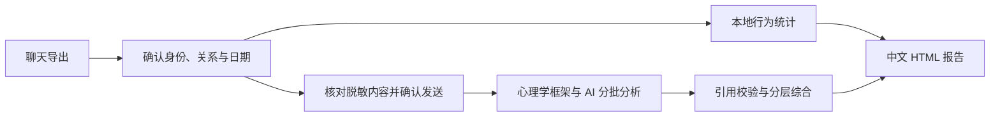

# ChatArchiveTool

**聊天归档 · 四类关系观察 · 中文论文式报告**

把 QQ／微信聊天记录整理成可离线回看的档案，再从朋友、亲人、恋人或闺蜜／亲密朋友的视角，观察互动方式与双方的表达形象。

`Windows x64` · `Python 3.12` · `本地基础分析` · `可选 AI API`

[快速开始](#快速开始) · [报告内容](#报告包含什么) · [心理学框架](#四类关系与心理学框架) · [开发文档](#开发与验证)

## 这个工具能做什么

| 能力 | 当前实现 |
| --- | --- |
| 聊天归档 | 导出或整合 QQ／微信聊天，关联图片、表情、音频和已有语音转写 |
| 导出文件读取 | 支持 QCE JSON、JSONL、带清单的分块文件夹、ZIP 和本工具统一档案 |
| 关系观察 | 确认双方身份，再选择朋友、亲人、恋人或闺蜜／亲密朋友视角 |
| 本地分析 | 统计联系节奏、会话发起、回应间隔与表达行为，无需 API |
| AI 分析 | 使用所选关系的心理学框架，完整分批处理文字并综合结果 |
| 报告输出 | 中文双栏 HTML、3D 日期热力图、统计图表、双方交流形象与沟通建议 |

关系分析目前支持**身份可辨认的双人会话**。四类关系由用户选择，作为观察视角使用。

## 从聊天到报告



| | 本地基础分析 | AI 分析 |
| --- | --- | --- |
| 是否需要密钥 | 无需 | 远程服务需要；本机服务可留空 |
| 处理内容 | 有效消息的行为统计、文字规则匹配 | 所选日期内全部有效文字与已有语音转写 |
| 结果侧重 | 互动节奏、表达习惯与回顾提示 | 基于语境的互动解释、表达特点与沟通建议 |
| 处理位置 | 本机，不上传聊天 | 用户核对并确认后发送至所选服务 |

本地模式提供描述性统计与规则提示。AI 模式把具体行为、心理学解释与其他可能原因分开呈现；双方画像只描述这段记录中的表达与回应。

## 快速开始

环境：**Windows x64、Python 3.12（包含 Tkinter）和浏览器**。本地基础分析与 AI 调用只使用 Python 标准库，可以直接体验。

1. 下载仓库 ZIP 并完整解压，或克隆仓库。
2. 进入项目根目录，双击 `start.cmd`，保持启动窗口运行。
3. 进入“关系分析”，选择 [`examples/synthetic-chat`](examples/synthetic-chat)。
4. 读取档案，确认哪位是你，选择关系，生成本地报告。

示例聊天完全由程序合成，不含真实个人数据。也可下载 [`examples/sample-report.html`](examples/sample-report.html)，用浏览器打开，查看本地报告的排版与图表。

```powershell
git clone https://github.com/schnitzlermandy85-beep/ChatArchiveTool.git
cd ChatArchiveTool
py -3.12 app.py --check
.\start.cmd
```

<details>
<summary>启动后没有浏览器窗口</summary>

保持启动窗口运行，再打开生成的 `打开界面.html`，或复制控制台中的本机网址到浏览器。启动日志位于 `logs/startup.log`。

也可以仅启动本机服务，再手工访问网址：

```powershell
py -3.12 app.py --no-browser
```

启动程序已加入浏览器快速失败后的回退，并将浏览器打开与本地服务分开运行。`start.cmd` 优先使用项目 `.venv`，其次使用 `py -3.12`，最后尝试 PATH 中的 Python。

</details>

## 用自己的聊天记录分析

支持载入：

- QQChatExporter 的 JSON、JSONL 或 ZIP。
- 包含 `manifest.json` 和完整消息分块的会话文件夹；选择会话主目录。
- 本工具导出的统一档案文件夹或 `messages.jsonl`。

读取后，确认身份，选择关系和日期。本地模式可直接生成报告；切换 AI 模式后，分别填写**服务地址、模型 ID、API Key**，检查发送预览，再开始分析。

AI 接口支持能按要求返回 JSON 文本的 **Chat Completions 兼容服务**，不限 DeepSeek。接受服务根地址、`/v1` 地址或完整 `/chat/completions` 地址；远程使用 HTTPS，本机允许 HTTP。具体兼容程度取决于服务商和模型。

全部有效文字按时间完整分批，已有转写一并处理；图片和未转写音频只参与本地统计。长记录会产生多次 API 调用及相应费用。全部批次与综合通过后才标记全量完成；超限会提示，失败会注明完成情况并回退本地统计。

“补充分析要求”最多 2000 字符，用于调整关注重点；主辅理论、引用要求和输出规则已内置。修改要求后需要重新核对预览。

## 四类关系与心理学框架

| 关系视角 | 主理论 | 辅助理论／研究 | 优先观察 |
| --- | --- | --- | --- |
| 亲人 | 家庭系统理论 | 角色理论、依恋理论 | 职责与期待、互动边界、支持与回应 |
| 恋人 | 依恋理论 | 爱情三角理论、相互依赖理论、Gottman 伴侣互动研究 | 亲近回应、共同约定、承诺表达与冲突修复 |
| 朋友 | 社会交换理论 | 社会渗透理论、互惠规范、关怀性与交换性关系区别 | 长期互助、共同活动与协调 |
| 闺蜜／亲密朋友 | 社会渗透理论 | 自我表露、社会支持、共同反刍研究 | 个人分享、接纳回应、情绪支持与隐私边界 |

四种视角共用八个观察维度：**亲近寻求与回应、角色义务与期待、自我表露与接纳、互惠协调、关系边界与约定、情绪支持、共同活动、未来计划与承诺**。不同关系改变优先顺序，证据不足时允许少作解释。

主辅配置是产品的观察顺序。理论用于组织互动解释，不诊断依恋类型、人格或疾病，不生成爱意、信任、匹配或关系质量分数，也不预测关系走向。引用校验和多片段标签是工程规则，不能证明心理解释正确。

详见 [完整内置分析要求与来源](docs/psychology-requirements.txt)。

## 报告包含什么

报告采用中文双栏正文，包含摘要、数据与方法、互动统计、关系观察、双方交流形象和沟通建议。

| 图表 | 回答的问题 |
| --- | --- |
| 3D 日期热力图 | 哪些日期有聊天，联系如何分布？ |
| 日内时段图 | 聊天通常发生在一天中的什么时候？ |
| 消息媒介构成图 | 文字、语音及其他媒介如何使用？ |
| 双方行为对照表 | 谁开启会话，记录中的回应间隔如何分布？ |

输出位于输入档案目录的 `relationship-reports/时间-随机标识/`：

- `report.html`：可离线打开，浏览器打印时可保存为 PDF。
- `report-data.json`：结构化统计与分析结果。

分享文件不内嵌完整聊天和发送预览；模型解释仍可能复述部分聊天内容，分享前请核对。

## 可选导出与语音组件

QQ 直接导出需要用户运行并登录 QQChatExporter，本工具通过其本机 API 调用。微信直接读取需要在界面中“安装 / 修复微信组件”，并依赖本机客户端版本和登录状态；真实微信数据库读取尚未纳入验证。

需要新语音转写时，安装可选依赖：

```powershell
py -3.12 -m venv .venv
.venv\Scripts\python.exe -m pip install -r requirements.txt
```

首次使用未下载的语音模型需要联网，也可在界面中指定已下载的模型目录。已有语音转写可以直接复用。

## 数据与隐私

本地模式不上传聊天。AI 模式只发送经用户核对并确认的脱敏文字与统计，不发送媒体文件、本地源路径或原始消息对象。自动脱敏不能识别所有姓名和事件，请检查预览。

API Key 只用于当次调用，不写入配置、报告或日志。聊天正文作为不可信材料处理，不能改变固定的分析规则。仓库仅保留源码、文档、测试与合成示例；真实导出、报告、模型、运行环境和密钥文件由 `.gitignore` 排除。

## 开发与验证

最近一次验证：**2026-10-08，115 项回归测试通过**，启动检查及前端脚本交互检查通过。完整测试额外需要 Pillow，用于微信表情缓存关联的合成测试：

```powershell
py -3.12 -m venv .venv
.venv\Scripts\python.exe -m pip install -r requirements-dev.txt
.venv\Scripts\python.exe run_tests.py
```

可选前端检查：`node tests/ui_smoke.cjs`。应用本身不需要 Node。真实云端 API、真实微信数据库读取和浏览器视觉效果尚未纳入验证。

- [项目结构与扩展入口](docs/architecture.md)
- [验证范围与记录](docs/validation.md)
- [心理学分析规则与来源](docs/psychology-requirements.txt)
- [第三方组件与来源](THIRD_PARTY_NOTICES.md)

## 第三方来源

保留 QQChatExporter、固定版本微信适配代码和可选语音组件的来源说明、原通知与许可证。详见 [第三方说明](THIRD_PARTY_NOTICES.md) 和 [`vendor/`](vendor/)。自有代码目前未另行授予开源许可。
