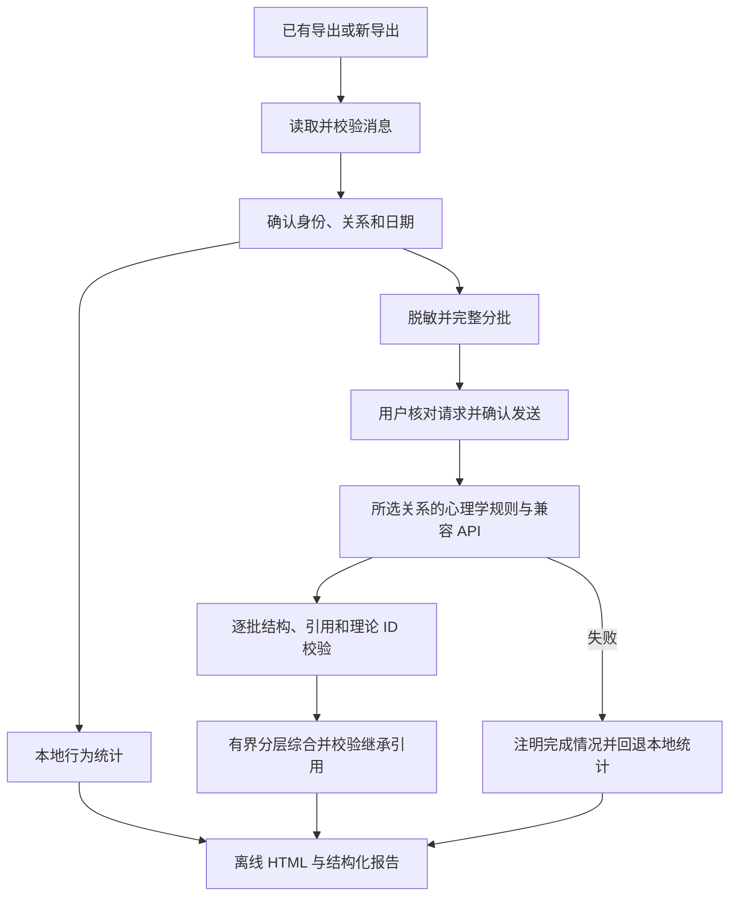

# 项目结构与扩展入口

| 文件／目录 | 职责 |
| --- | --- |
| `start.cmd`、`start.command`、`app.py` | Windows／Mac 启动、环境检查、日志、打包后的辅助进程分派 |
| `platform_support.py` | 平台能力、可写数据目录、系统文件夹打开 |
| `ChatArchiveTool.spec`、`scripts/`、`.github/workflows/release.yml` | 原生打包、实包冒烟验证、三平台 Release 发布 |
| `web_app.py`、`filepicker.py` | 本机 HTTP 服务、任务状态、文件选择、浏览器入口 |
| `web/` | 导出和关系分析界面、请求预览、报告交互 |
| `core.py` | QQ API、媒体关联、统一档案及本地语音转写 |
| `wechat_adapter.py`、`wechat_worker.py`、`setup_wechat.py` | 微信适配、独立读取进程、可选组件安装 |
| `analysis_input.py` | 统一档案与 QCE JSON／JSONL／分块／ZIP 读取和校验 |
| `relationship.py` | 身份、日期、脱敏、统计、完整分批、模型调用与综合校验 |
| `psychology_frameworks.py` | 四种关系的主辅理论、八维定义、固定推断要求 |
| `psychology_references.py` | 已核验的理论来源白名单 |
| `relationship_report.py` | 自包含中文论文式 HTML 与分享 JSON |
| `viewer.html` | 归档聊天的离线浏览模板 |
| `tests/`、`run_tests.py` | 合成数据回归测试和前端交互检查 |
| `examples/` | 合成双人会话与本地示例报告 |
| `vendor/` | 带许可证和固定来源的第三方代码 |

扩展关系框架时同步维护理论注册表、八维定义、提示词、来源白名单及对应测试。扩展输入格式时在输入适配层归一化，避免业务层读取原始未知字段。AI 的每批、中间综合和最终综合均使用同一框架，改变规则需要使旧预览失效。

本地服务绑定环回地址并使用当次授权令牌。语音和微信组件在可选路径加载；程序目录附近的开发运行环境回退仅用于旧工作区兼容，源码仓库不附带这些组件。

桌面包中的 `ROOT` 只定位只读资源；`data_root(ROOT)` 定位用户日志、默认导出和可选微信组件。`CHATARCHIVE_DATA_DIR` 可为测试或便携部署显式指定数据目录。冻结程序通过 `--helper filepicker` 或 `--helper wechat_worker` 启动已知辅助入口，不将应用当成 Python 解释器。Mac 文件选择使用系统 `osascript`，Windows 使用独立进程的 Tkinter。
